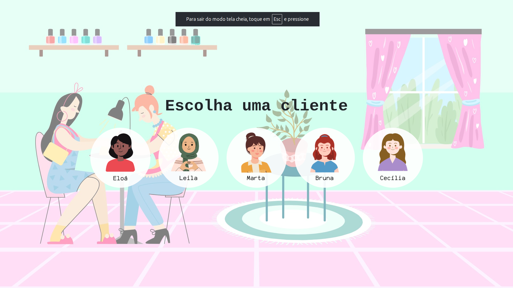
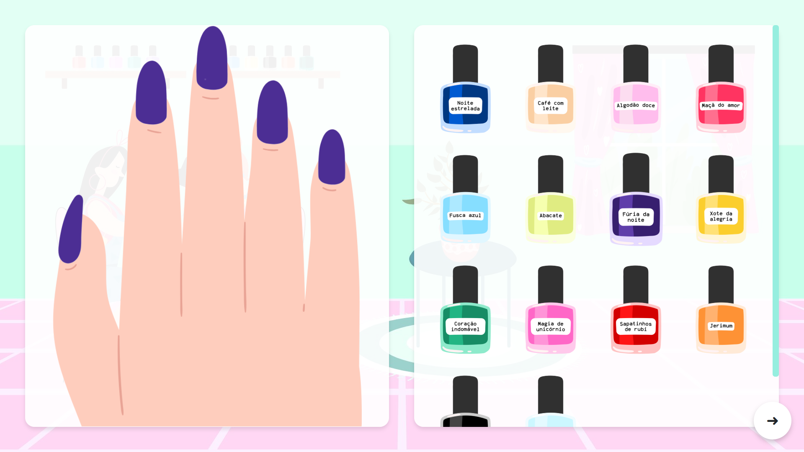
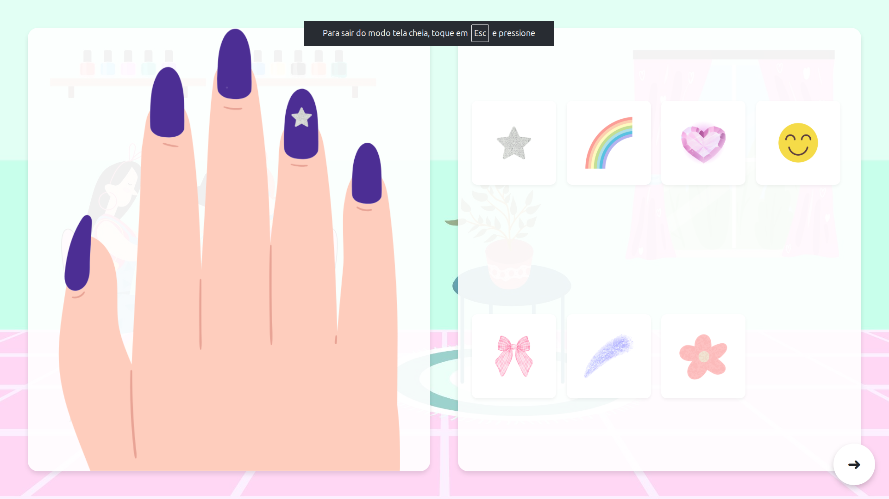
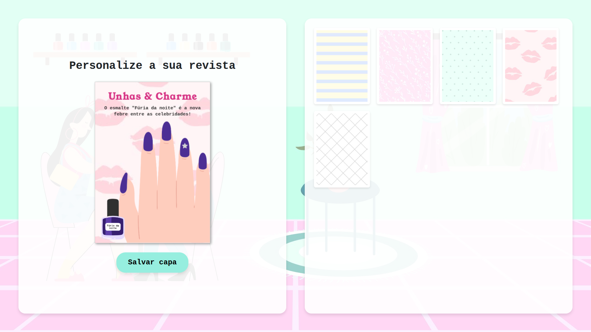

  

  <h1>💅 Jogo de unhas</h1>

  

    Um jogo interativo de manicure e design de unhas desenvolvido com JavaScript e Fabric.js.
  

  

    
  

  

    
    
    
    
    
  

 

## Sobre o projeto

Este projeto é uma simulação de salão de beleza onde o usuário pode vivenciar todo o processo de manicure, desde a escolha da cliente a ser atendida até a criação de uma capa de revista personalizada com o resultado final.

## Funcionalidades

| 1. Escolha de pele | 2. Esmaltação |
|:---:|:---:|
|  |  |
| Escolha entre clientes com diferentes tons de pele. | Seleção de cores de esmaltes com nomes criativos. |

| 3. Decoração | 4. Capa de revista |
|:---:|:---:|
|  |  |
| Aplicação de adesivos e pedrarias. | Gere e baixe a capa da revista com as unhas feitas. |

## Tecnologias utilizadas

* **HTML5 & CSS3:** Estrutura e estilização responsiva.
* **JavaScript:** Lógica de interação e manipulação do DOM.
* **Bootstrap:** Grid system e responsividade para mobile.
* **Fabric.js:** Biblioteca para manipulação de canvas, usada na geração da revista.

## Autora

<a href="https://www.google.com/search?q=https://github.com/brininha">    <b>Sabrina Cristan</b> </a>

